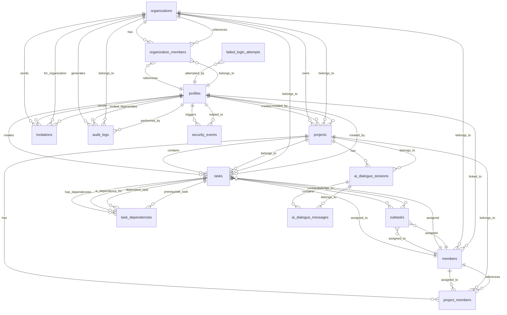

# Claude Task Master Database Relationships

## Entity Relationship Diagram



## Relationship Details

### Organizations (Root Entity)

**organizations** is the root entity for multi-tenancy:

- Has many **organization_members** (users belonging to the organization)
- Has many **projects** (projects owned by the organization)
- Has many **invitations** (pending invitations)
- Generates **audit_logs** for all activities

### User Management

**profiles** (extends Supabase auth.users):

- Belongs to many **organizations** through **organization_members**
- Can create **projects** and **tasks**
- All actions generate **audit_logs**
- Security events tracked in **security_events**

**organization_members** (junction table):

- Links **profiles** to **organizations**
- Defines role (admin/member)
- Tracks invitation and join metadata

### Project Hierarchy

**projects**:

- Belongs to one **organization**
- Created by one **profile** (user)
- Contains many **tasks**
- Has **ai_dialogue_sessions** for PRD generation
- Has **project_members** (legacy, being phased out)

**tasks**:

- Belongs to one **project**
- Belongs to one **organization** (denormalized for performance)
- Created by one **profile**
- Can be assigned to one **member**
- Has many **subtasks**
- Can have dependencies on other tasks

**subtasks**:

- Belongs to one **task**
- Can be assigned to one **member**
- Inherits organization context from parent task

### Task Dependencies

**task_dependencies** (self-referential many-to-many):

- Links tasks that depend on each other
- **task_id**: The dependent task
- **depends_on_task_id**: The prerequisite task
- Prevents circular dependencies through application logic

### Member Management (Legacy)

**members** (being phased out):

- Legacy table for member management
- Being replaced by organization_members + profiles
- Still referenced by tasks and subtasks for assignments

**project_members**:

- Legacy junction table
- Links members to projects
- Being replaced by organization-based access

### Invitation System

**invitations**:

- Belongs to one **organization**
- Invited by one **profile** (user)
- Contains token for acceptance
- Expires after set period

### AI Integration

**ai_dialogue_sessions**:

- Belongs to one **project**
- Contains conversation context
- Stores PRD quality metrics

**ai_dialogue_messages**:

- Belongs to one **ai_dialogue_session**
- Stores conversation history
- Tracks user/assistant roles

### Security & Audit

**audit_logs**:

- Belongs to one **organization**
- Performed by one **profile** (user)
- Tracks all significant actions
- Includes IP and user agent data

**security_events**:

- Related to one **profile** (user)
- Tracks security-specific events
- Includes severity levels

**failed_login_attempts**:

- Tracks by email (not necessarily existing user)
- Used for brute force protection
- Implements account lockout

## Key Constraints

### Unique Constraints

- **organizations.slug**: Ensures unique organization URLs
- **members.email**: Ensures unique emails in legacy system
- **invitations.token**: Ensures unique invitation tokens
- **organization_members**: (organization_id, user_id) composite unique

### Foreign Key Cascades

- Deleting an organization cascades to:

  - Projects
  - Organization members
  - Invitations
  - Audit logs

- Deleting a project cascades to:

  - Tasks
  - AI dialogue sessions

- Deleting a task cascades to:
  - Subtasks
  - Task dependencies

### Data Integrity Rules

1. Users cannot be members of an organization multiple times
2. Tasks cannot depend on themselves (circular dependency)
3. Organizations must have at least one admin
4. Deleted users' audit logs are preserved
5. Security events are immutable

## Query Patterns

### Common Joins

1. **User's Organizations**:

```sql
SELECT o.* FROM organizations o
JOIN organization_members om ON o.id = om.organization_id
WHERE om.user_id = ? AND om.status = 'active'
```

2. **Project Tasks with Assignees**:

```sql
SELECT t.*, m.name as assignee_name
FROM tasks t
LEFT JOIN members m ON t.assignee_id = m.id
WHERE t.project_id = ?
```

3. **Task Dependencies**:

```sql
SELECT t2.* FROM tasks t1
JOIN task_dependencies td ON t1.id = td.task_id
JOIN tasks t2 ON td.depends_on_task_id = t2.id
WHERE t1.id = ?
```

4. **Organization Audit Trail**:

```sql
SELECT al.*, p.full_name
FROM audit_logs al
JOIN profiles p ON al.user_id = p.id
WHERE al.organization_id = ?
ORDER BY al.created_at DESC
```

## Performance Considerations

### Indexes

- All foreign keys are indexed
- Composite indexes on frequently queried combinations
- Partial indexes for filtered queries

### Denormalization

- **organization_id** on tasks for faster queries
- **created_by** on tasks to avoid joins
- Task counts cached in project statistics

### Query Optimization

- Use of CTEs for complex dependency queries
- Materialized views for reporting (planned)
- Connection pooling for concurrent access
