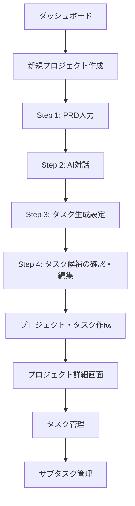

# Task Master - PRD作成からタスク・サブタスク作成までの詳細フローとUI/UX

## 目次
1. [概要](#概要)
2. [全体フロー](#全体フロー)
3. [Step 1: PRD入力](#step-1-prd入力)
4. [Step 2: AI対話によるPRD品質向上](#step-2-ai対話によるprd品質向上)
5. [Step 3: 確認・生成](#step-3-確認生成)
6. [プロジェクト詳細画面](#プロジェクト詳細画面)
7. [タスク管理](#タスク管理)
8. [サブタスク管理](#サブタスク管理)
9. [技術実装詳細](#技術実装詳細)

## 概要

Task Masterは、PRD（Product Requirements Document：製品要求仕様書）からAIを活用して自動的にタスクとサブタスクを生成し、プロジェクト管理を効率化するWebアプリケーションです。

### 主要な特徴
- **3ステップウィザード形式**でのプロジェクト作成
- **AI対話**によるPRD品質の向上
- **自動タスク生成**（5〜20タスクの範囲で調整可能）
- **階層構造**によるタスク・サブタスク管理
- **依存関係管理**によるタスク実行順序の最適化

## 全体フロー



## Step 1: PRD入力

### UI/UXデザイン
- **場所**: `/projects/new` ページ
- **コンポーネント**: `app/projects/new/page.tsx`

### 入力フィールド

#### 1. プロジェクト名
```
- フィールドタイプ: テキスト入力
- プレースホルダー: "例: ECサイトリニューアル"
- バリデーション: 必須項目
```

#### 2. PRD（製品要求仕様書）
```
- フィールドタイプ: 複数行テキストエリア
- 最小高さ: 400px
- フォント: 等幅フォント（font-mono）
- 特徴:
  - Markdown形式サポート
  - リアルタイムPRD品質チェック
  - テンプレート提供
```

### PRDテンプレート
```markdown
# プロジェクト概要

## 背景と目的
現在のシステムの課題と、このプロジェクトで実現したいことを記載してください。

## 機能要件
- 機能1: 説明
- 機能2: 説明
- 機能3: 説明

## 非機能要件
- パフォーマンス要件
- セキュリティ要件
- 可用性要件

## 技術要件
使用する技術スタックや制約事項を記載してください。
```

### リアルタイム品質チェック
入力中に以下の項目を自動チェック:
- 概要（overview）の有無
- 機能要件（features）の有無
- 技術要件（technical requirements）の有無
- ユーザーストーリー（user stories）の有無

## Step 2: AI対話によるPRD品質向上

### UI/UXデザイン
- **レイアウト**: 3カラムグリッド（2:1の比率）
- **メインエリア**: AI対話インターフェース
- **サイドバー**: PRD品質スコア表示

### 対話モード選択

#### 1. ガイド型（Guided）
```
AIが以下の質問を順番に提示:
1. このプロジェクトの主要な目標は何ですか？
2. 想定されるユーザーは誰ですか？
3. 最も重要な機能を3つ教えてください。
```

#### 2. 対話型（Interactive）
```
ユーザーが自由に質問や補足情報を提供
AIが文脈に応じて適切な質問やアドバイスを返答
```

### PRD品質スコアリング

#### 評価セクション（各セクション0-100%）
1. **概要セクション**
   - プロジェクトの背景
   - 目的と目標
   - スコープ定義

2. **技術仕様**
   - アーキテクチャ
   - 技術スタック
   - インフラ要件

3. **開発ロードマップ**
   - フェーズ分け
   - マイルストーン
   - タイムライン

4. **論理的依存関係**
   - タスク間の依存関係
   - 実行順序の定義

5. **リスクと対策**
   - 技術的リスク
   - ビジネスリスク
   - 対策計画

6. **付録**
   - 参考資料
   - 用語定義
   - 関連ドキュメント

### リアルタイムスコア表示
```
- 各セクションのプログレスバー
- 不足項目の表示（最大2項目まで表示）
- 総合品質スコア（推奨: 70%以上）
- 色分け表示:
  - 緑: 70%以上
  - 黄: 40-69%
  - 赤: 40%未満
```

## Step 3: タスク生成設定

### タスク分割設定
```
- スライダーUI: 5〜20タスクの範囲で調整
- リアルタイム推定時間表示:
  - 5タスク: 1週間
  - 10タスク: 2-3週間
  - 15タスク: 3-4週間
  - 20タスク: 1ヶ月以上
```

### オプション設定
```
□ 最新の技術動向を調査して提案に含める
  - AIが最新の技術トレンドを調査
  - 推奨される技術スタックの提案
```

### 生成内容プレビュー
```
生成される内容:
• N個の実装タスク候補
• 各タスクの詳細な実装手順
• 推奨される実行順序
• （オプション）最新技術の調査結果と推奨事項
```

### アクション
```
[タスクを生成] ボタン
- タスク候補を生成（DBには保存しない）
- Step 4へ遷移
```

## Step 4: タスク候補の確認・編集

### UI/UXデザイン
- **コンポーネント**: `TaskCandidateEditor.tsx`
- **レイアウト**: タスクカードのリスト形式

### タスク候補の表示
```
タスク #1 [ドラッグハンドル]              [優先度選択] [削除]
├─ タイトル: [編集可能]
├─ 説明: [編集可能]
├─ 実装詳細: [編集可能]
└─ テスト戦略: [編集可能]

タスク #2 [ドラッグハンドル]              [優先度選択] [削除]
├─ タイトル: [編集可能]
├─ 説明: [編集可能]
├─ 実装詳細: [編集可能]
└─ テスト戦略: [編集可能]

[+ タスクを追加]
```

### 編集機能
1. **インライン編集**
   - 各フィールドをクリックで編集モード
   - Enterキーまたはフォーカス外れで保存
   - Escapeキーでキャンセル

2. **ドラッグ&ドロップ**
   - @dnd-kit/coreライブラリ使用
   - タスクの順序を視覚的に変更
   - 自動で順序番号を更新

3. **タスク追加・削除**
   - 手動でタスクを追加（初期値付き）
   - 個別タスクの削除
   - 最低1タスク必須

4. **優先度設定**
   - High/Medium/Low の選択
   - 色分け表示（赤/黄/青）

### データ管理
```javascript
// ローカルストレージ自動保存
- セッションIDベースのキー管理
- 編集操作ごとに自動保存
- 24時間後に自動削除
- プロジェクト作成成功時にクリア
```

### バリデーション
```
- タスクタイトル必須
- 最低1タスク必要
- 依存関係チェックなし（Step 4では省略）
```

### アクション
```
[戻る] [タスクを確定して作成]
- 戻る: Step 3へ戻る
- 確定: プロジェクトとタスクを一括作成してプロジェクト詳細へ遷移
```

## プロジェクト詳細画面

### UI/UXデザイン
- **場所**: `/projects/[projectId]` ページ
- **コンポーネント**: `app/projects/[projectId]/page.tsx`

### ビューモード切り替え
```
[リスト] [依存関係] [ガント] [統計]
※ 現在はリストビューのみ実装
```

### プロジェクト情報表示
```
プロジェクト名
├─ 進捗: XX%（完了タスク/全タスク）
├─ 残り日数: XX日
└─ チームメンバー: [アバター表示]
```

### タスクリスト機能
1. **検索・フィルタリング**
   ```
   - フリーワード検索
   - ステータスフィルター
   - 優先度フィルター
   - 担当者フィルター
   - ラベルフィルター
   ```

2. **一括操作**
   ```
   - 全選択/選択解除
   - 選択したタスクの一括更新
   - 選択したタスクの一括削除
   ```

3. **ソート機能**
   ```
   - 優先度順
   - 期限順
   - ステータス順
   - 作成日順
   ```

## タスク管理

### タスク詳細パネル
- **表示形式**: 右側からスライドインするモーダル
- **コンポーネント**: `TaskDetailPanel.tsx`

### タスク情報の構造
```
タスクタイトル
├─ 説明（Description）
│   └─ Markdownエディタ
├─ 実装詳細（Implementation Details）
│   └─ AIが生成した詳細な実装手順
├─ テスト戦略（Test Strategy）
│   └─ テストケースと検証方法
└─ サブタスク
    ├─ 進捗表示（X/Y完了）
    ├─ サブタスクリスト
    └─ AIサブタスク生成ボタン
```

### メタデータ管理（サイドバー）
```
優先度: [High] [Medium] [Low]
担当者: [ドロップダウン選択]
期限: [日付ピッカー]
見積もり工数: [時間入力]
実績工数: [時間入力]
ラベル: [タグ選択]
依存関係: 
  - ブロックされている: [タスクリスト]
  - ブロックしている: [タスクリスト]
```

### タスクステータス
```
- pending: 保留中
- not-started: 未着手
- in-progress: 進行中
- review: レビュー中
- completed: 完了
- blocked: ブロック
- deferred: 延期
- cancelled: キャンセル
```

## サブタスク管理

### UI/UXデザイン
- **コンポーネント**: `SubtaskManager.tsx`
- **表示位置**: タスク詳細パネル内

### サブタスク機能
1. **追加**
   ```
   [+] 新しいサブタスクを追加
   - インライン編集
   - Enterキーで保存
   ```

2. **AI自動生成**
   ```
   [AIアイコン] サブタスクを自動生成
   - 親タスクの内容を分析
   - 3-5個のサブタスクを提案
   - ワンクリックで一括追加
   ```

3. **管理機能**
   ```
   □ サブタスクタイトル
   ├─ チェックボックスで完了管理
   ├─ ホバーで編集・削除ボタン表示
   └─ ドラッグ&ドロップで順序変更（実装予定）
   ```

4. **進捗表示**
   ```
   プログレスバー: [====------] 40%
   完了状況: 2/5 完了
   ```

## 技術実装詳細

### バックエンドAPI構造

#### プロジェクト関連エンドポイント
```
POST   /api/v1/projects                 # プロジェクト作成
GET    /api/v1/projects                 # プロジェクト一覧
GET    /api/v1/projects/:id             # プロジェクト詳細
PUT    /api/v1/projects/:id             # プロジェクト更新
DELETE /api/v1/projects/:id             # プロジェクト削除
POST   /api/v1/projects/ai-dialogue     # AI対話セッション
POST   /api/v1/projects/:id/prd/finalize # 最終PRD生成
```

#### タスク生成関連エンドポイント（新規）
```
POST   /api/v1/generate-tasks-preview    # タスク候補生成（DB保存なし）
POST   /api/v1/tasks/batch-create        # プロジェクトとタスクの一括作成
```

#### タスク関連エンドポイント
```
GET    /api/v1/tasks                    # タスク一覧
GET    /api/v1/tasks/:id                # タスク詳細
POST   /api/v1/tasks                    # タスク作成
PUT    /api/v1/tasks/:id                # タスク更新
PATCH  /api/v1/tasks/:id/status         # ステータス更新
DELETE /api/v1/tasks/:id                # タスク削除
POST   /api/v1/tasks/:id/expand         # AIサブタスク生成
POST   /api/v1/tasks/:id/subtasks       # サブタスク追加
PUT    /api/v1/tasks/:id/subtasks/:sid  # サブタスク更新
DELETE /api/v1/tasks/:id/subtasks/:sid  # サブタスク削除
POST   /api/v1/tasks/:id/dependencies   # 依存関係追加
DELETE /api/v1/tasks/:id/dependencies/:did # 依存関係削除
```

### データベース構造

#### projectsテーブル
```sql
- id: 整数（主キー）
- name: テキスト（必須）
- description: テキスト
- deadline: 日付
- status: テキスト
- prd_content: テキスト
- organization_id: 整数（外部キー）
- created_at: タイムスタンプ
- updated_at: タイムスタンプ
```

#### tasksテーブル
```sql
- id: 整数（主キー）
- title: テキスト（必須）
- description: テキスト
- details: テキスト
- test_strategy: テキスト
- priority: 列挙型（high/medium/low）
- status: テキスト
- assignee_id: UUID（外部キー）
- project_id: 整数（外部キー）
- deadline: 日付
- organization_id: 整数（外部キー）
- created_at: タイムスタンプ
- updated_at: タイムスタンプ
```

#### subtasksテーブル
```sql
- id: 整数（主キー）
- task_id: 整数（外部キー）
- title: テキスト（必須）
- description: テキスト
- status: テキスト（pending/completed）
- assignee_id: UUID（外部キー）
- created_at: タイムスタンプ
- updated_at: タイムスタンプ
```

#### task_dependenciesテーブル
```sql
- task_id: 整数（外部キー）
- depends_on_task_id: 整数（外部キー）
- created_at: タイムスタンプ
主キー: (task_id, depends_on_task_id)
```

### AI統合

#### PRD品質向上AI
```javascript
// PRD品質スコア計算ロジック
const analyzePRDQuality = (prdContent) => {
  const sections = {
    overview: evaluateOverviewSection(prdContent),
    technical: evaluateTechnicalSection(prdContent),
    roadmap: evaluateRoadmapSection(prdContent),
    dependencies: evaluateDependenciesSection(prdContent),
    risks: evaluateRisksSection(prdContent),
    appendix: evaluateAppendixSection(prdContent)
  };
  
  return calculateOverallScore(sections);
};
```

#### タスク自動生成AI
```javascript
// AIプロンプト構造
const generateTasksPrompt = {
  systemPrompt: "PRDから実装タスクを生成",
  userPrompt: `
    PRD内容: ${prdContent}
    タスク数: ${targetTaskCount}
    研究モード: ${useResearchMode}
  `,
  outputFormat: {
    tasks: [{
      title: "タスクタイトル",
      description: "タスク説明",
      details: "実装詳細",
      test_strategy: "テスト戦略",
      priority: "high|medium|low",
      dependencies: ["依存タスクID"]
    }]
  }
};
```

### フロントエンド技術スタック
- **フレームワーク**: Next.js 14（App Router）
- **UI ライブラリ**: shadcn/ui
- **スタイリング**: Tailwind CSS
- **状態管理**: React Hooks + Context API
- **API通信**: カスタムAPIクライアント（`lib/api.ts`）
- **認証**: カスタム認証フック（`lib/auth.tsx`）

### セキュリティと権限管理
1. **認証**: 全APIエンドポイントで認証必須
2. **組織ベースアクセス制御**: ユーザーは所属組織のデータのみアクセス可能
3. **プロジェクト権限**: 組織メンバーのみプロジェクトにアクセス可能
4. **削除権限**: 組織管理者のみプロジェクト削除可能

### パフォーマンス最適化
1. **遅延読み込み**: タスク詳細は必要時のみ取得
2. **楽観的更新**: UIの即座更新とバックグラウンドでのAPI同期
3. **キャッシング**: セッションストレージを活用したAI対話の継続性
4. **バッチ処理**: 複数タスクの一括更新対応