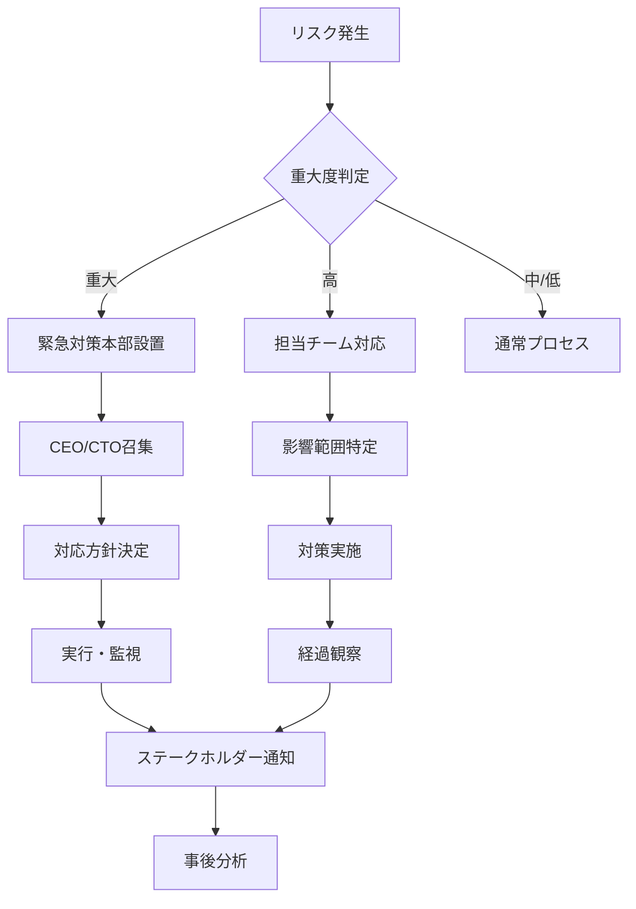

# リスク管理

## 1. リスク評価マトリックス

### 1.1 リスクレベル定義
| 影響度/発生確率 | 低 (1) | 中 (2) | 高 (3) |
|----------------|--------|--------|--------|
| **高 (3)** | 中リスク (3) | 高リスク (6) | 重大リスク (9) |
| **中 (2)** | 低リスク (2) | 中リスク (4) | 高リスク (6) |
| **低 (1)** | 最小リスク (1) | 低リスク (2) | 中リスク (3) |

### 1.2 対応優先度
- **重大リスク (7-9)**: 即時対応必須
- **高リスク (5-6)**: 早期対応計画
- **中リスク (3-4)**: 定期モニタリング
- **低リスク (1-2)**: 受容可能

## 2. 技術的リスク

### 2.1 外部依存リスク

#### Task Master API依存
- **リスク内容**: API障害時のサービス停止
- **影響度**: 高 (3)
- **発生確率**: 中 (2)
- **リスクレベル**: 高 (6)
- **対策**:
  ```typescript
  // フォールバック実装
  const taskService = {
    async getTasks(projectId: string) {
      try {
        return await taskMasterAPI.getTasks(projectId);
      } catch (error) {
        // キャッシュから取得
        const cached = await cache.get(`tasks:${projectId}`);
        if (cached) return cached;
        
        // ローカルDBから取得
        return await localDB.getTasks(projectId);
      }
    }
  };
  ```

#### Supabase障害
- **リスク内容**: データベース/認証サービス停止
- **影響度**: 高 (3)
- **発生確率**: 低 (1)
- **リスクレベル**: 中 (3)
- **対策**:
  - 定期バックアップ（日次）
  - マルチリージョン対応検討
  - 障害時の緊急連絡体制

### 2.2 スケーラビリティリスク

#### パフォーマンス劣化
- **リスク内容**: ユーザー増加によるレスポンス低下
- **影響度**: 中 (2)
- **発生確率**: 高 (3)
- **リスクレベル**: 高 (6)
- **対策**:
  ```yaml
  scaling_strategy:
    immediate:
      - Redis導入によるキャッシング
      - CDN活用
      - データベースインデックス最適化
    
    short_term:
      - 読み取りレプリカ追加
      - API レート制限実装
      - バックグラウンドジョブ最適化
    
    long_term:
      - マイクロサービス化
      - Kubernetes導入
      - グローバル分散
  ```

### 2.3 セキュリティリスク

#### データ漏洩
- **リスク内容**: 機密情報の外部流出
- **影響度**: 高 (3)
- **発生確率**: 低 (1)
- **リスクレベル**: 中 (3)
- **対策**:
  ```typescript
  // セキュリティ実装例
  const securityMeasures = {
    encryption: {
      atRest: 'AES-256',
      inTransit: 'TLS 1.3',
      keys: 'AWS KMS'
    },
    access: {
      authentication: 'JWT + 2FA',
      authorization: 'RBAC',
      audit: 'All actions logged'
    },
    monitoring: {
      intrusion: 'Real-time detection',
      vulnerability: 'Weekly scans',
      compliance: 'Quarterly audits'
    }
  };
  ```

## 3. ビジネスリスク

### 3.1 市場リスク

#### 競合他社の台頭
- **リスク内容**: 大手企業の参入による市場シェア喪失
- **影響度**: 高 (3)
- **発生確率**: 中 (2)
- **リスクレベル**: 高 (6)
- **対策**:
  - 独自機能の特許申請
  - 顧客ロックイン戦略
  - 継続的イノベーション
  - パートナーシップ構築

#### 市場ニーズの変化
- **リスク内容**: AIツールへの需要減少
- **影響度**: 中 (2)
- **発生確率**: 低 (1)
- **リスクレベル**: 低 (2)
- **対策**:
  - 定期的な市場調査
  - ピボット可能な設計
  - 多様な収益源確保

### 3.2 財務リスク

#### 資金調達の遅延
- **リスク内容**: 開発資金の枯渇
- **影響度**: 高 (3)
- **発生確率**: 中 (2)
- **リスクレベル**: 高 (6)
- **対策**:
  ```yaml
  financial_planning:
    runway:
      - 最低6ヶ月分の運転資金確保
      - 段階的な資金調達計画
    
    revenue:
      - 早期の有料化
      - 複数の収益モデル
      - コスト最適化
    
    contingency:
      - 緊急時の人員削減計画
      - アウトソース活用
      - 機能縮小プラン
  ```

### 3.3 法的リスク

#### コンプライアンス違反
- **リスク内容**: 個人情報保護法違反
- **影響度**: 高 (3)
- **発生確率**: 低 (1)
- **リスクレベル**: 中 (3)
- **対策**:
  - 法務アドバイザー契約
  - プライバシーポリシー整備
  - 定期的な法令チェック
  - 従業員教育

## 4. 運用リスク

### 4.1 人的リスク

#### キーパーソンの離脱
- **リスク内容**: 重要メンバーの退職
- **影響度**: 高 (3)
- **発生確率**: 中 (2)
- **リスクレベル**: 高 (6)
- **対策**:
  ```yaml
  retention_strategy:
    compensation:
      - 競争力のある給与
      - ストックオプション
      - 成果報酬
    
    environment:
      - リモートワーク対応
      - 学習機会の提供
      - キャリアパス明確化
    
    knowledge:
      - ドキュメント化徹底
      - ペアプログラミング
      - 知識共有セッション
  ```

#### スキル不足
- **リスク内容**: 必要な技術力の欠如
- **影響度**: 中 (2)
- **発生確率**: 中 (2)
- **リスクレベル**: 中 (4)
- **対策**:
  - 継続的な技術研修
  - 外部専門家の活用
  - メンタリング制度

### 4.2 プロジェクト管理リスク

#### スケジュール遅延
- **リスク内容**: リリース計画の大幅遅れ
- **影響度**: 中 (2)
- **発生確率**: 高 (3)
- **リスクレベル**: 高 (6)
- **対策**:
  - バッファを含んだ計画
  - アジャイル開発手法
  - 継続的な進捗モニタリング
  - スコープの柔軟な調整

## 5. 災害・事故リスク

### 5.1 自然災害
- **リスク内容**: 地震、台風等によるサービス停止
- **影響度**: 高 (3)
- **発生確率**: 低 (1)
- **リスクレベル**: 中 (3)
- **対策**:
  - BCP（事業継続計画）策定
  - データの地理的分散
  - リモートワーク体制
  - 緊急時連絡網

### 5.2 サイバー攻撃
- **リスク内容**: DDoS、ランサムウェア等
- **影響度**: 高 (3)
- **発生確率**: 中 (2)
- **リスクレベル**: 高 (6)
- **対策**:
  ```typescript
  const cyberSecurityPlan = {
    prevention: {
      waf: 'Cloudflare Enterprise',
      ddos: 'Rate limiting + CDN',
      malware: 'Regular scanning'
    },
    detection: {
      monitoring: '24/7 SOC',
      alerts: 'Real-time notification',
      analysis: 'AI-based detection'
    },
    response: {
      isolation: 'Automatic quarantine',
      recovery: 'Backup restoration',
      investigation: 'Forensic analysis'
    }
  };
  ```

## 6. リスク対応計画

### 6.1 リスク対応戦略
1. **回避**: リスクの原因を取り除く
2. **軽減**: 影響度や発生確率を下げる
3. **転嫁**: 保険やアウトソーシング
4. **受容**: コストを考慮して受け入れる

### 6.2 緊急時対応フロー


## 7. モニタリング体制

### 7.1 定期レビュー
- **週次**: 技術的リスクの確認
- **月次**: ビジネスリスクの評価
- **四半期**: 全体リスク見直し

### 7.2 KRIモニタリング
```typescript
// Key Risk Indicators
const kri = {
  technical: {
    apiErrorRate: { threshold: 1, current: 0.3 },
    responseTime: { threshold: 2000, current: 800 },
    uptime: { threshold: 99.9, current: 99.95 }
  },
  business: {
    churnRate: { threshold: 5, current: 3.2 },
    cashRunway: { threshold: 6, current: 8 },
    nps: { threshold: 30, current: 45 }
  },
  security: {
    vulnerabilities: { threshold: 0, current: 0 },
    incidents: { threshold: 1, current: 0 },
    patchDelay: { threshold: 7, current: 3 }
  }
};
```

## 8. 保険・補償

### 8.1 加入推奨保険
- **サイバー保険**: データ漏洩、サイバー攻撃
- **事業中断保険**: サービス停止による損失
- **専門職業責任保険**: サービス不具合による損害
- **D&O保険**: 役員の経営判断リスク

### 8.2 SLA設定
```yaml
service_level_agreement:
  availability:
    target: 99.9%
    measurement: Monthly
    credit:
      - 99.0-99.9%: 10% credit
      - 95.0-99.0%: 25% credit
      - <95.0%: 50% credit
  
  performance:
    api_response: <1000ms (95 percentile)
    page_load: <3000ms (95 percentile)
  
  support:
    critical: 1 hour response
    high: 4 hour response
    normal: 24 hour response
```

## 9. 継続的改善

### 9.1 リスク文化の醸成
- リスク報告の推奨
- 失敗から学ぶ文化
- 定期的な訓練実施

### 9.2 改善サイクル
1. **特定**: 新たなリスクの発見
2. **評価**: 影響度と確率の再評価
3. **対策**: 対応策の立案と実施
4. **検証**: 効果測定と調整
5. **共有**: 組織全体への展開