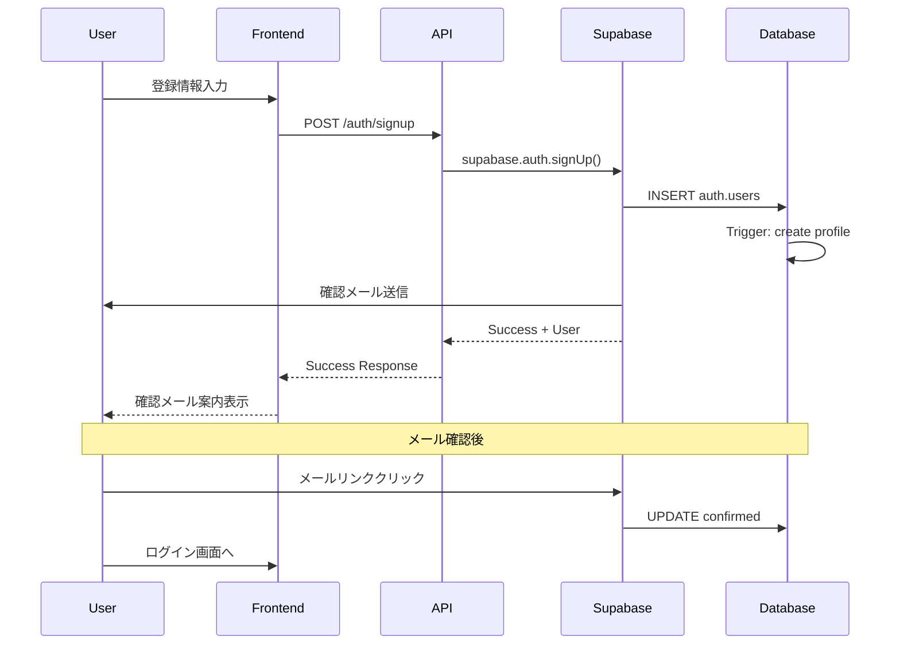
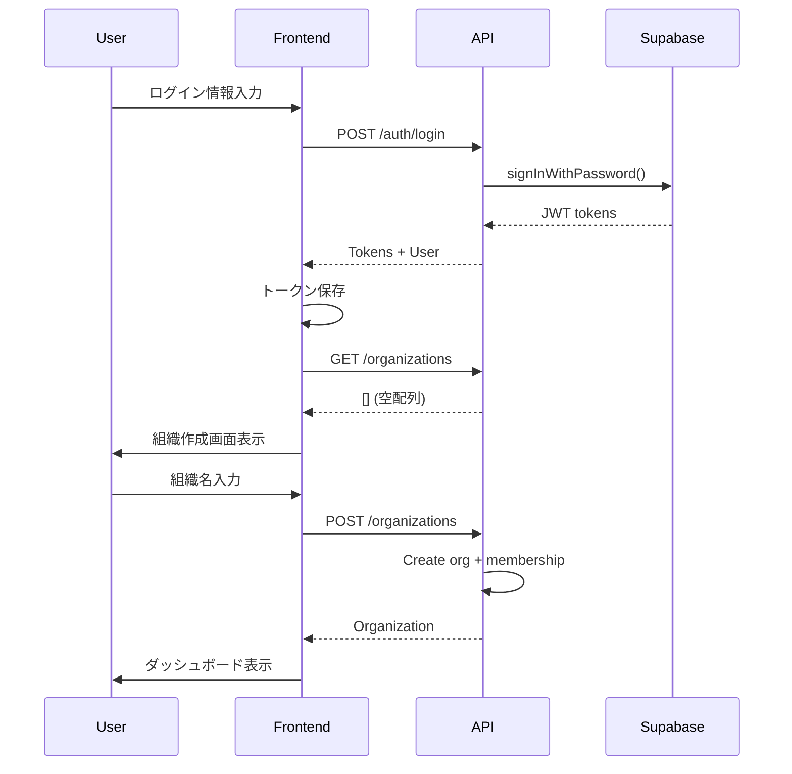
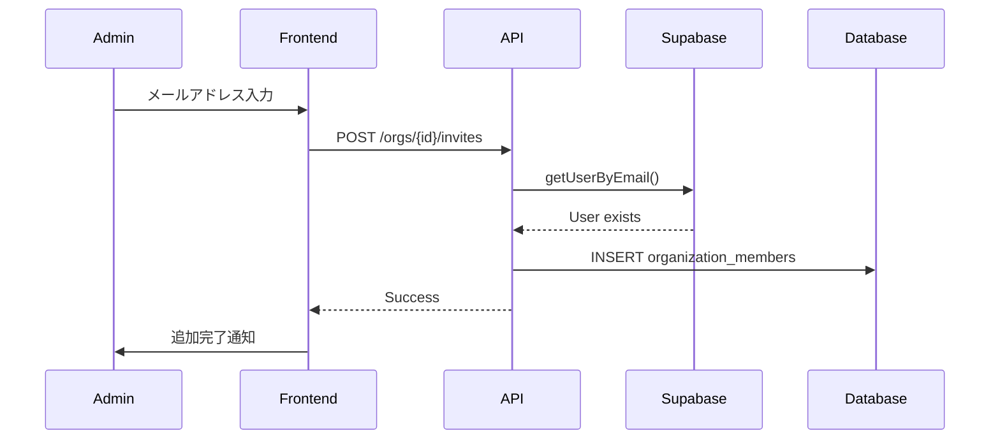

# 認証システム概要

## 1. システムアーキテクチャ

### 1.1 概要
Task Masterの認証システムは、Supabase Authを基盤として構築され、以下の主要コンポーネントで構成されています：

- **Supabase Auth**: 認証基盤（JWT発行、ユーザー管理）
- **PostgreSQL + RLS**: データアクセス制御
- **Express.js API**: 認証ミドルウェアとビジネスロジック
- **Next.js Frontend**: 認証UI とクライアント側状態管理

### 1.2 アーキテクチャ図

```
┌─────────────────┐     ┌──────────────────┐     ┌─────────────────┐
│   Next.js App   │────▶│  Express.js API  │────▶│   PostgreSQL    │
│                 │     │                  │     │   + Supabase    │
│ - AuthContext   │     │ - Auth MW        │     │ - RLS Policies  │
│ - Protected     │     │ - RBAC MW        │     │ - Triggers      │
│   Routes        │     │ - API Routes     │     │ - Functions     │
└─────────────────┘     └──────────────────┘     └─────────────────┘
         │                       │                         │
         └───────────────────────┴─────────────────────────┘
                        Supabase Auth Service
```

## 2. 認証フロー

### 2.1 新規登録フロー



### 2.2 ログイン → 組織作成フロー



### 2.3 招待フロー（既存ユーザー）



## 3. セキュリティ設計

### 3.1 認証レイヤー

1. **JWT認証**
   - アクセストークン（有効期限: 1時間）
   - リフレッシュトークン（有効期限: 7日間）
   - Authorization: Bearer <token> ヘッダー

2. **ミドルウェア構成**
   ```javascript
   // 認証が必要なルート
   router.use(authMiddleware);
   
   // 管理者権限が必要なルート
   router.use(authMiddleware, rbacMiddleware(['admin']));
   ```

3. **データベースレベルセキュリティ（RLS）**
   - すべてのテーブルでRLS有効
   - ユーザーは所属組織のデータのみアクセス可能
   - auth.uid()を使用したポリシー

### 3.2 パスワードセキュリティ

- Supabase Authによる自動ハッシュ化（bcrypt）
- パスワード要件：
  - 最小8文字
  - 大文字・小文字・数字・特殊文字を推奨

### 3.3 セッション管理

- JWTベースのステートレスセッション
- クライアント側でのトークン保存（localStorage/Cookie）
- 自動リフレッシュ機能

## 4. データモデル

### 4.1 主要テーブル

```sql
-- 組織
organizations (
  id uuid PRIMARY KEY,
  name text NOT NULL,
  created_at timestamptz
)

-- プロファイル
profiles (
  id uuid PRIMARY KEY REFERENCES auth.users,
  full_name text,
  avatar_url text,
  updated_at timestamptz
)

-- 組織メンバー
organization_members (
  organization_id uuid REFERENCES organizations,
  profile_id uuid REFERENCES profiles,
  role text CHECK (role IN ('admin', 'member')),
  PRIMARY KEY (organization_id, profile_id)
)
```

### 4.2 リレーションシップ

- 1ユーザー : Nの組織（マルチテナント対応）
- 組織作成者は自動的にadminロール
- projectsとtasksは組織に紐付け

## 5. エラーハンドリング

### 5.1 認証エラー

| エラーコード | 説明 | HTTPステータス |
|------------|------|---------------|
| AUTH_REQUIRED | 認証が必要 | 401 |
| INVALID_TOKEN | 無効なトークン | 401 |
| TOKEN_EXPIRED | トークン期限切れ | 401 |
| FORBIDDEN | 権限不足 | 403 |

### 5.2 ビジネスロジックエラー

| エラーコード | 説明 | HTTPステータス |
|------------|------|---------------|
| ORG_NOT_FOUND | 組織が見つからない | 404 |
| USER_NOT_MEMBER | 組織のメンバーではない | 403 |
| INVALID_ROLE | 無効なロール | 400 |

## 6. 拡張性考慮事項

### 6.1 将来の機能拡張

- OAuth プロバイダー対応（Google, GitHub）
- 2要素認証（2FA）
- より詳細な権限管理（RBAC拡張）
- 監査ログ機能
- シングルサインオン（SSO）

### 6.2 スケーラビリティ

- ステートレス設計によるAPI水平スケーリング
- データベースレベルでのマルチテナント分離
- CDNを活用した静的アセット配信