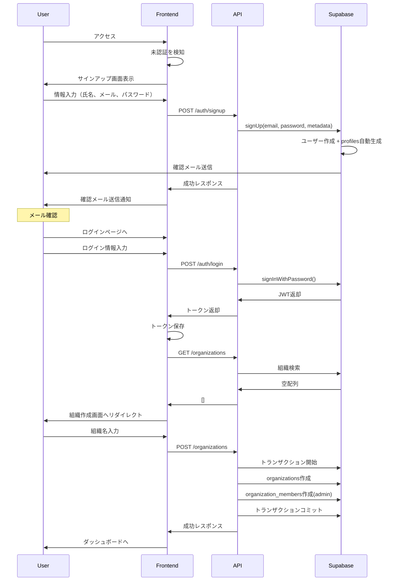
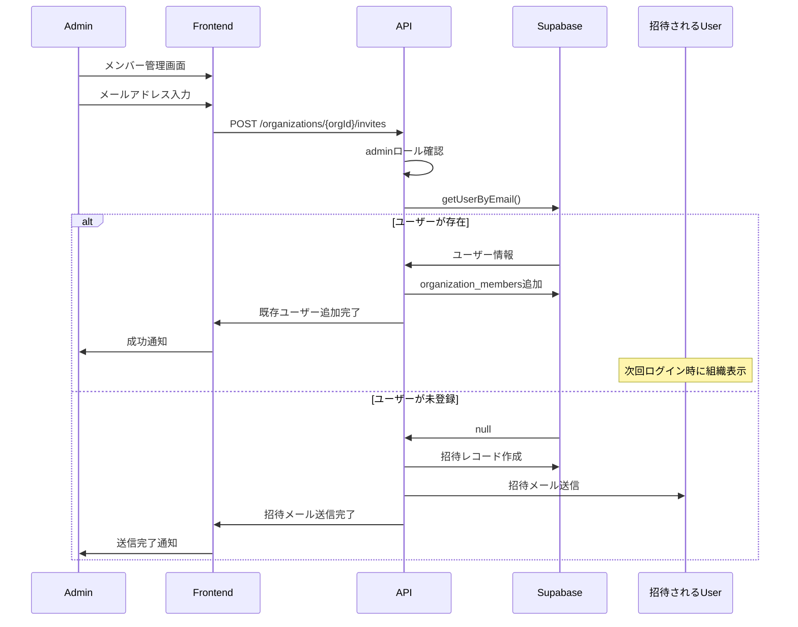

# 認証・組織管理システム概要

## 1. システムが実現したいこと（What）

Task Masterアプリケーションに堅牢かつスケーラブルなユーザー認証と組織管理の基盤を構築します。

### 提供する価値

1. **セキュリティの確立**
   - 許可されたユーザーのみがプロジェクトデータにアクセス可能
   - アプリケーションの安全性を保証

2. **パーソナライズされた体験**
   - ユーザーごとにタスクやプロジェクトを管理
   - 個人の作業環境を提供

3. **チームコラボレーションの基盤**
   - Solo ModeからMultiplayer Modeへのシームレスな移行
   - 「組織」概念による将来的な機能拡張の基盤

4. **シームレスなユーザー体験**
   - 新規登録からログイン、組織参加まで直感的な操作
   - 洗練されたワークフロー

## 2. アーキテクチャ概要

### 技術スタック

- **認証基盤**: Supabase Auth
- **データベース**: PostgreSQL with RLS (Supabase)
- **API**: Node.js/Express.js
- **フロントエンド**: React/Next.js
- **セッション管理**: JWT (Access Token + Refresh Token)

### システム構成図

```
┌─────────────────┐     ┌─────────────────┐     ┌─────────────────┐
│   Frontend      │────▶│   API Server    │────▶│   Supabase      │
│  (Next.js)      │     │  (Express.js)   │     │   (Auth + DB)   │
└─────────────────┘     └─────────────────┘     └─────────────────┘
        │                        │                        │
        │                        │                        │
        ▼                        ▼                        ▼
   - Login/Signup          - JWT検証              - ユーザー管理
   - 組織選択              - RBAC                 - RLSポリシー
   - メンバー管理          - APIルーティング      - データ永続化
```

## 3. 主要な認証フロー

### 3.1 サインアップ → 初回ログイン → 組織作成



### 3.2 既存ユーザーの招待フロー



## 4. セキュリティアーキテクチャ

### 4.1 認証レイヤー

1. **JWT構成**
   - Access Token: 15分有効
   - Refresh Token: 7日有効
   - ペイロード: `{ id, email, iat, exp }`

2. **ミドルウェア構成**
   ```javascript
   app.use('/api/v1/*', authMiddleware);  // JWT検証
   app.use('/api/v1/organizations/:orgId/*', rbacMiddleware);  // 権限確認
   ```

### 4.2 データアクセス制御

1. **RLS (Row Level Security)**
   - 全テーブルでRLS有効化
   - ユーザーは所属組織のデータのみアクセス可能

2. **ロールベースアクセス制御**
   - `admin`: 組織の全権限
   - `member`: 基本的な読み書き権限

## 5. エラーハンドリング戦略

### 標準エラーレスポンス形式

```json
{
  "error": {
    "code": "AUTH_INVALID_TOKEN",
    "message": "認証トークンが無効です",
    "details": {
      "timestamp": "2024-01-01T00:00:00Z",
      "request_id": "req_123456"
    }
  }
}
```

### 主要なエラーコード

- `AUTH_INVALID_TOKEN`: 無効なトークン
- `AUTH_EXPIRED_TOKEN`: 期限切れトークン
- `AUTH_INSUFFICIENT_PERMISSIONS`: 権限不足
- `ORG_NOT_FOUND`: 組織が見つからない
- `USER_NOT_FOUND`: ユーザーが見つからない

## 6. パフォーマンス最適化

1. **キャッシング戦略**
   - 組織情報のメモリキャッシュ（5分）
   - ユーザー権限のリクエストスコープキャッシュ

2. **クエリ最適化**
   - インデックスの適切な設定
   - N+1問題の回避

3. **レスポンスタイム目標**
   - 認証API: < 500ms
   - 組織データAPI: < 1000ms

## 7. 監視とロギング

1. **ログ項目**
   - 認証成功/失敗
   - 権限エラー
   - APIレスポンスタイム

2. **メトリクス**
   - 認証成功率
   - APIエラー率
   - 平均レスポンスタイム

## 8. 今後の拡張性

1. **SSO対応**
   - OAuth2.0プロバイダー統合
   - SAML対応

2. **詳細な権限管理**
   - カスタムロール
   - リソースレベル権限

3. **監査ログ**
   - 全アクションの記録
   - コンプライアンス対応