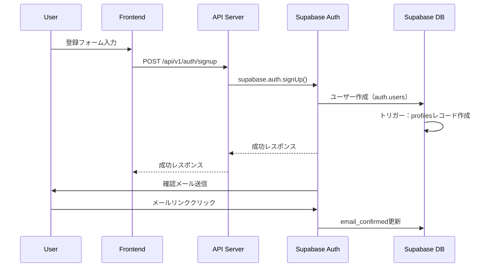
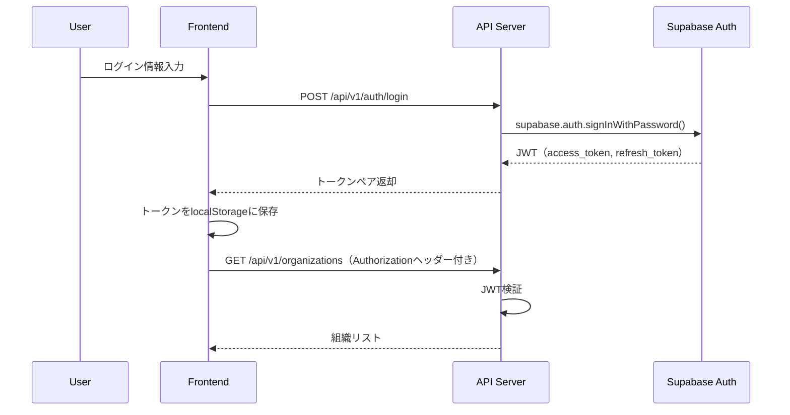

# 認証システム概要

## 1. システムの目的と価値提案

### 1.1 ビジネス価値

Task Master認証システムは、以下の価値を提供します：

1. **セキュリティの確立**
   - 許可されたユーザーのみがプロジェクトデータにアクセス
   - 組織レベルでのデータ隔離
   - 監査ログとアクセス制御

2. **パーソナライズされた体験**
   - ユーザー固有のダッシュボード
   - 個人設定の永続化
   - タスク割り当てとトラッキング

3. **チームコラボレーション基盤**
   - Solo Mode（個人利用）からMultiplayer Mode（チーム利用）への移行
   - 組織単位でのプロジェクト管理
   - ロールベースの権限管理

### 1.2 技術的目標

- **スケーラビリティ**: 将来的な成長に対応可能な設計
- **セキュリティ**: 業界標準のセキュリティプラクティスの実装
- **開発効率**: Supabaseの既存機能を最大限活用
- **ユーザビリティ**: シンプルで直感的な認証フロー

## 2. システムアーキテクチャ

### 2.1 全体構成

```
┌─────────────────┐     ┌─────────────────┐     ┌─────────────────┐
│                 │     │                 │     │                 │
│   Frontend      │────▶│   API Server    │────▶│   Supabase      │
│   (Next.js)     │     │   (Express)     │     │   (Auth + DB)   │
│                 │     │                 │     │                 │
└─────────────────┘     └─────────────────┘     └─────────────────┘
         │                       │                       │
         │                       │                       │
         ▼                       ▼                       ▼
    [JWT Token]           [Auth Middleware]         [RLS Policies]
```

### 2.2 認証フロー

#### 2.2.1 新規登録フロー



#### 2.2.2 ログインフロー



### 2.3 コンポーネント構成

#### 2.3.1 Frontend コンポーネント

- **認証関連コンポーネント**
  - `LoginForm`: ログインフォーム
  - `SignupForm`: 新規登録フォーム
  - `ForgotPasswordForm`: パスワードリセット
  - `OrganizationSetup`: 組織初期設定
  - `UserProfile`: ユーザープロファイル管理

- **認証状態管理**
  - `AuthContext`: 認証状態のグローバル管理
  - `useAuth`: 認証関連のカスタムフック
  - `ProtectedRoute`: 認証必須ルートの保護

#### 2.3.2 API Server ミドルウェア

- **認証ミドルウェア** (`/api/middleware/auth.js`)
  ```javascript
  // JWT検証とユーザー情報の取得
  async function authMiddleware(req, res, next) {
    const token = req.headers.authorization?.split(' ')[1];
    if (!token) return res.status(401).json({ error: 'Unauthorized' });
    
    try {
      const { data: { user }, error } = await supabase.auth.getUser(token);
      if (error) throw error;
      req.user = user;
      next();
    } catch (error) {
      res.status(401).json({ error: 'Invalid token' });
    }
  }
  ```

- **RBAC ミドルウェア** (`/api/middleware/rbac.js`)
  ```javascript
  // ロールベースアクセス制御
  function requireRole(requiredRole) {
    return async (req, res, next) => {
      const { organizationId } = req.params;
      const { data: member } = await supabase
        .from('organization_members')
        .select('role')
        .eq('organization_id', organizationId)
        .eq('profile_id', req.user.id)
        .single();
      
      if (member?.role === requiredRole) {
        req.organizationMember = member;
        next();
      } else {
        res.status(403).json({ error: 'Forbidden' });
      }
    };
  }
  ```

### 2.4 データフロー

#### 2.4.1 組織データのアクセス制御

```sql
-- RLSポリシー例：組織のプロジェクトへのアクセス
CREATE POLICY "Users can view projects in their organizations" ON projects
  FOR SELECT USING (
    organization_id IN (
      SELECT organization_id 
      FROM organization_members 
      WHERE profile_id = auth.uid()
    )
  );
```

#### 2.4.2 タスク割り当ての管理

```sql
-- タスクの担当者フィールド
ALTER TABLE tasks 
ADD COLUMN assignee_id UUID REFERENCES profiles(id) ON DELETE SET NULL;

-- RLSポリシー：自分に割り当てられたタスクの参照
CREATE POLICY "Users can view assigned tasks" ON tasks
  FOR SELECT USING (
    assignee_id = auth.uid() OR
    project_id IN (
      SELECT id FROM projects 
      WHERE organization_id IN (
        SELECT organization_id 
        FROM organization_members 
        WHERE profile_id = auth.uid()
      )
    )
  );
```

## 3. 主要機能の詳細

### 3.1 ユーザー管理機能

1. **アカウント作成**
   - メール確認プロセス
   - パスワード強度検証
   - プロファイル自動生成

2. **認証**
   - JWT ベース認証
   - リフレッシュトークン
   - セッション管理

3. **プロファイル管理**
   - 氏名・アバター更新
   - パスワード変更
   - アカウント削除

### 3.2 組織管理機能

1. **組織作成**
   - 初回ログイン時の組織セットアップ
   - 組織名・説明の設定
   - 管理者ロールの自動付与

2. **メンバー管理**
   - メール招待システム
   - ロール管理（admin/member）
   - メンバー削除

3. **組織切り替え**
   - 複数組織への所属対応
   - アクティブ組織の切り替え
   - 組織別ダッシュボード

## 4. 非機能要件

### 4.1 セキュリティ要件

- **パスワード保護**: bcryptによるハッシュ化
- **通信暗号化**: HTTPS必須
- **トークン管理**: 適切な有効期限設定
- **CSRF対策**: トークンベース保護
- **XSS対策**: 入力値検証とサニタイゼーション

### 4.2 パフォーマンス要件

- **レスポンスタイム**: 認証API 500ms以内
- **同時接続数**: 1000ユーザー同時ログイン対応
- **可用性**: 99.9%のアップタイム

### 4.3 ユーザビリティ要件

- **エラーメッセージ**: 明確で実用的なエラー表示
- **ローディング状態**: 適切なフィードバック
- **モバイル対応**: レスポンシブデザイン

## 5. 段階的実装計画

### Phase 1: 基本認証（2週間）
- [ ] Supabase Auth設定
- [ ] 基本的な登録・ログイン
- [ ] JWT認証ミドルウェア
- [ ] 基本的なRLS実装

### Phase 2: 組織管理（2週間）
- [ ] 組織CRUD機能
- [ ] メンバー招待システム
- [ ] ロール管理
- [ ] 組織切り替えUI

### Phase 3: 高度な機能（1週間）
- [ ] パスワードリセット
- [ ] メール通知
- [ ] アクティビティログ
- [ ] セキュリティ強化

## 6. 既存システムとの統合

### 6.1 API層の変更

- すべてのAPIエンドポイントに認証ミドルウェアを追加
- ユーザーコンテキストに基づくデータフィルタリング
- 組織IDをベースにしたデータ分離

### 6.2 フロントエンド層の変更

- APIクライアントへの認証ヘッダー追加
- 認証状態管理の実装
- 保護されたルートの実装

### 6.3 データベース層の変更

- 既存テーブルへの外部キー追加
- RLSポリシーの実装
- マイグレーションスクリプトの作成