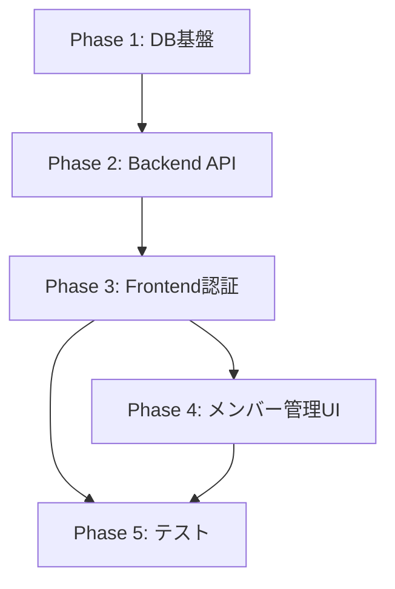

# Task Master 認証機能 - AIタスク分解ドキュメント

## 概要
このドキュメントは、Task Masterの認証・組織管理機能を実装するための詳細なタスク分解と、各タスクをAIに依頼する際のプロンプトを記載しています。

## Phase 3: フロントエンド統合 (5人日)

### Task 3.1: 認証コンテキストとプロバイダーの実装 (0.5人日)
**プロンプト**:
```
Task Masterのフロントエンドに認証コンテキストを実装してください。

要件:
1. `frontend/task-master-ui/contexts/AuthContext.tsx`を作成
2. Supabase Authと連携する認証状態管理
3. ユーザー情報、組織情報の管理
4. ログイン/ログアウト/サインアップメソッドの提供
5. TypeScriptの型定義を含む

必要な機能:
- useAuth フック
- AuthProvider コンポーネント
- 認証状態の永続化
- トークンの自動更新
```

### Task 3.2: 認証フックの実装 (0.5人日)
**プロンプト**:
```
Task Masterの認証関連カスタムフックを実装してください。

実装するフック:
1. `frontend/task-master-ui/hooks/useAuth.ts` - 認証状態とメソッドへのアクセス
2. `frontend/task-master-ui/hooks/useRequireAuth.ts` - 認証必須ページ用
3. `frontend/task-master-ui/hooks/useOrganization.ts` - 組織情報管理

要件:
- TypeScript完全対応
- エラーハンドリング
- ローディング状態の管理
```

### Task 3.3: ログイン/サインアップコンポーネント (1人日)
**プロンプト**:
```
Task Masterの認証画面コンポーネントを実装してください。

実装するコンポーネント:
1. `frontend/task-master-ui/components/auth/LoginForm.tsx`
2. `frontend/task-master-ui/components/auth/SignupForm.tsx`
3. `frontend/task-master-ui/app/auth/login/page.tsx`
4. `frontend/task-master-ui/app/auth/signup/page.tsx`

要件:
- メールとパスワードによる認証
- フォームバリデーション
- エラーメッセージ表示
- ローディング状態
- レスポンシブデザイン
- 既存のUIコンポーネント（ui/button, ui/input等）を使用
```

### Task 3.4: 組織セットアップコンポーネント (1人日)
**プロンプト**:
```
初回ログイン時の組織作成画面を実装してください。

実装内容:
1. `frontend/task-master-ui/components/auth/OrganizationSetup.tsx`
2. `frontend/task-master-ui/app/setup-organization/page.tsx`

要件:
- 組織名入力フォーム
- 組織作成API呼び出し
- 作成後のダッシュボードへのリダイレクト
- エラーハンドリング
```

### Task 3.5: 保護されたルートの実装 (1人日)
**プロンプト**:
```
Task Masterのルート保護機能を実装してください。

実装内容:
1. `frontend/task-master-ui/components/auth/ProtectedRoute.tsx`
2. 既存ページの認証統合
3. 未認証時のリダイレクト処理

要件:
- app/layout.tsxでAuthProviderをラップ
- 各ページで認証チェック
- 組織未設定時の/setup-organizationへのリダイレクト
```

### Task 3.6: 既存コンポーネントの認証対応 (1人日)
**プロンプト**:
```
既存のTask Masterコンポーネントに認証機能を統合してください。

更新対象:
1. lib/api.ts - 認証ヘッダーの追加
2. ProjectList, TaskTable等 - 組織IDでのフィルタリング
3. ナビゲーション - ユーザー情報表示、ログアウトボタン

要件:
- すべてのAPI呼び出しにJWTトークンを含める
- 401エラー時の再ログイン処理
- ユーザー/組織コンテキストの使用
```

## Phase 4: 招待システムとメンバー管理UI (4人日)

### Task 4.1: メンバー管理ページ (1人日)
**プロンプト**:
```
組織のメンバー管理ページを実装してください。

実装内容:
1. `frontend/task-master-ui/app/settings/members/page.tsx`
2. `frontend/task-master-ui/components/members/MemberList.tsx`

機能:
- メンバー一覧表示
- ロール表示（Admin/Member）
- メンバー検索
- ページネーション
```

### Task 4.2: 招待コンポーネント (1人日)
**プロンプト**:
```
メンバー招待機能のUIを実装してください。

実装内容:
1. `frontend/task-master-ui/components/members/InviteModal.tsx`
2. `frontend/task-master-ui/components/members/InviteForm.tsx`

機能:
- メールアドレス入力
- 招待送信
- 成功/エラーフィードバック
- 既存ユーザーの自動追加通知
```

### Task 4.3: ロール管理UI (1人日)
**プロンプト**:
```
メンバーのロール変更機能を実装してください。

実装内容:
1. `frontend/task-master-ui/components/members/RoleSelector.tsx`
2. `frontend/task-master-ui/components/members/MemberActions.tsx`

機能:
- Admin/Memberロールの切り替え
- メンバー削除
- 確認ダイアログ
- 権限チェック（Adminのみ操作可能）
```

### Task 4.4: プロファイル管理 (1人日)
**プロンプト**:
```
ユーザープロファイル管理画面を実装してください。

実装内容:
1. `frontend/task-master-ui/app/settings/profile/page.tsx`
2. `frontend/task-master-ui/components/profile/ProfileForm.tsx`

機能:
- 氏名の編集
- パスワード変更
- アカウント削除
- アバター画像アップロード（将来対応）
```

## Phase 5: テストとドキュメント (3人日)

### Task 5.1: APIテスト (1人日)
**プロンプト**:
```
認証APIのテストを実装してください。

実装内容:
1. `tests/api/unit/auth.test.js`
2. `tests/api/unit/organizations.test.js`
3. `tests/api/integration/auth-flow.test.js`

テスト項目:
- 認証エンドポイントのユニットテスト
- 組織管理エンドポイントのテスト
- 認証フロー統合テスト
- エラーケースのテスト
```

### Task 5.2: フロントエンドテスト (1人日)
**プロンプト**:
```
認証関連のフロントエンドテストを実装してください。

実装内容:
1. `frontend/task-master-ui/__tests__/auth/LoginForm.test.tsx`
2. `frontend/task-master-ui/__tests__/auth/AuthContext.test.tsx`
3. `frontend/task-master-ui/__tests__/members/MemberList.test.tsx`

テスト項目:
- コンポーネントの単体テスト
- フック のテスト
- 認証フローのE2Eテスト
```

### Task 5.3: ドキュメント更新 (1人日)
**プロンプト**:
```
認証機能のドキュメントを更新してください。

更新内容:
1. README.mdに認証セットアップ手順を追加
2. 環境変数の説明を追加
3. API仕様書の更新
4. フロントエンド開発ガイドの更新

含める内容:
- Supabase設定手順
- 環境変数一覧
- 認証フロー図
- トラブルシューティング
```

## 実装順序と依存関係



## 見積もり合計

- Phase 1: 3人日 (完了)
- Phase 2: 5人日 (完了)
- Phase 3: 5人日
- Phase 4: 4人日
- Phase 5: 3人日

**残り作業: 12人日**

## 注意事項

1. 各タスクは独立して実装可能ですが、Phase順序は守ってください
2. 既存機能との後方互換性を維持してください
3. TypeScriptの型安全性を確保してください
4. セキュリティガイドラインに従ってください
5. 各実装後は必ずテストを実行してください