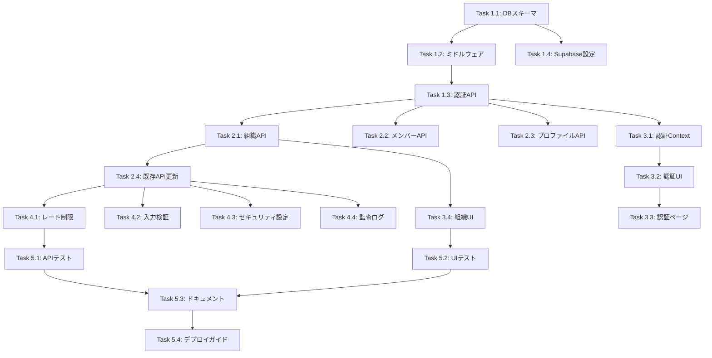

# Task Master 認証機能実装タスク

## 概要

このドキュメントは、Task Master認証機能の実装を細分化したタスクと、各タスクをAIに依頼する際のプロンプトを記載しています。

## Phase 1: 基盤構築（推定工数: 2週間）

### Task 1.1: Supabase認証設定とデータベーススキーマ作成

**依頼プロンプト:**
```
Task Master APIプロジェクトで認証機能の基盤を構築してください。

要件:
1. supabase/schema.sql を更新して、以下のテーブルを追加してください：
   - organizations（組織管理）
   - profiles（ユーザープロファイル、auth.usersを参照）
   - organization_members（組織メンバー管理）
   - invitations（招待管理）

2. 既存のprojectsテーブルにorganization_idカラムを追加
3. 既存のtasksテーブルにassignee_idカラムを追加（profiles参照）
4. 必要なトリガー（handle_new_user）を作成
5. 基本的なRLSポリシーを実装

詳細な仕様は requirements-docs/authentication/02-database-schema.md を参照してください。

注意事項:
- 既存のmembersテーブルをproject_membersにリネームする処理も含めてください
- マイグレーションスクリプトとして実行可能な形式で作成してください
```

### Task 1.2: 認証ミドルウェアの実装

**依頼プロンプト:**
```
Task Master APIに認証ミドルウェアを実装してください。

実装内容:
1. api/middleware/auth.js を新規作成
   - JWT検証機能
   - Supabase Authとの連携
   - ユーザー情報の取得とreq.userへの格納

2. api/middleware/rbac.js を新規作成
   - ロールベースアクセス制御（admin/member）
   - 組織メンバーシップの検証

3. エラーハンドリングの実装
   - 適切なエラーコードとメッセージ

参考実装は requirements-docs/authentication/03-api-endpoints.md のミドルウェア実装セクションを確認してください。

既存のコードベースとの整合性を保ちながら実装してください。
```

### Task 1.3: 認証APIエンドポイントの実装

**依頼プロンプト:**
```
Task Master APIに認証関連のエンドポイントを実装してください。

1. api/routes/auth.js を新規作成して以下のエンドポイントを実装：
   - POST /api/v1/auth/signup（ユーザー登録）
   - POST /api/v1/auth/login（ログイン）
   - POST /api/v1/auth/logout（ログアウト）
   - POST /api/v1/auth/refresh（トークンリフレッシュ）
   - DELETE /api/v1/auth/user（アカウント削除）

2. api/server-db.js にルートを追加

3. バリデーションとエラーハンドリングを含む

仕様詳細は requirements-docs/authentication/03-api-endpoints.md を参照してください。
既存のAPIパターン（レスポンス形式、エラー形式）に従ってください。
```

### Task 1.4: 環境設定とSupabaseクライアント更新

**依頼プロンプト:**
```
Task Master APIのSupabase設定を認証対応に更新してください。

1. api/db/supabase.js を更新：
   - 認証を有効化（autoRefreshToken: true, persistSession: true）
   - 適切なオプション設定

2. .env.example を更新：
   - 必要な環境変数を追加（JWT_SECRET等）

3. Supabaseプロジェクトの設定手順をドキュメント化
   - SUPABASE_SETUP.md を更新

現在の実装を確認し、認証機能に必要な変更のみを加えてください。
```

## Phase 2: 組織管理機能（推定工数: 2週間）

### Task 2.1: 組織管理APIの実装

**依頼プロンプト:**
```
Task Master APIに組織管理機能を実装してください。

1. api/routes/organizations.js を新規作成：
   - POST /api/v1/organizations（組織作成）
   - GET /api/v1/organizations（組織一覧）
   - GET /api/v1/organizations/{id}（組織詳細）
   - PUT /api/v1/organizations/{id}（組織更新）

2. 認証ミドルウェアの適用
3. 適切な権限チェック（管理者のみ更新可能等）

仕様は requirements-docs/authentication/03-api-endpoints.md の組織管理セクションを参照。
トランザクション処理に注意してください。
```

### Task 2.2: メンバー管理APIの実装

**依頼プロンプト:**
```
Task Master APIにメンバー管理機能を実装してください。

1. organizations.js に以下のエンドポイントを追加：
   - POST /api/v1/organizations/{orgId}/invites（メンバー招待）
   - GET /api/v1/organizations/{orgId}/members（メンバー一覧）
   - PUT /api/v1/organizations/{orgId}/members/{profileId}（ロール更新）
   - DELETE /api/v1/organizations/{orgId}/members/{profileId}（メンバー削除）

2. 既存ユーザーと新規ユーザーの招待処理を実装
3. メール送信のスタブ実装（実際の送信は後のタスク）

仕様は requirements-docs/authentication/03-api-endpoints.md のメンバー管理セクションを参照。
```

### Task 2.3: ユーザープロファイルAPIの実装

**依頼プロンプト:**
```
Task Master APIにユーザープロファイル管理機能を実装してください。

1. api/routes/users.js を新規作成：
   - GET /api/v1/users/profile（プロファイル取得）
   - PUT /api/v1/users/profile（プロファイル更新）
   - PUT /api/v1/users/password（パスワード変更）

2. 認証必須の設定
3. 自分のプロファイルのみ編集可能な制限

既存のmembersテーブルとの関連性に注意してください。
```

### Task 2.4: 既存APIの認証対応

**依頼プロンプト:**
```
Task Master APIの既存エンドポイントを認証対応してください。

1. 以下のファイルに認証ミドルウェアを適用：
   - api/routes/projects-db.js
   - api/routes/tasks-db.js
   - api/routes/subtasks.js
   - api/routes/members.js

2. organization_idベースのデータフィルタリング実装
3. RLSと連携したデータアクセス制御

注意事項:
- 既存の機能を壊さないよう、段階的に実装
- テスト用の認証スキップモードを環境変数で制御
```

## Phase 3: フロントエンド統合（推定工数: 1.5週間）

### Task 3.1: 認証コンテキストとフックの実装

**依頼プロンプト:**
```
Task MasterのNext.jsフロントエンドに認証機能を実装してください。

1. contexts/AuthContext.tsx を新規作成：
   - ユーザー状態管理
   - ログイン/ログアウト機能
   - トークン管理

2. hooks/useAuth.ts の実装
3. APIクライアント（lib/api.ts）の更新：
   - 認証ヘッダーの自動付与
   - トークンリフレッシュ機能

仕様は requirements-docs/authentication/04-frontend-integration.md を参照。
既存のコンポーネント構造を維持してください。
```

### Task 3.2: 認証UIコンポーネントの実装

**依頼プロンプト:**
```
Task Masterフロントエンドに認証関連のUIコンポーネントを実装してください。

1. 以下のコンポーネントを作成：
   - components/auth/LoginForm.tsx
   - components/auth/SignupForm.tsx
   - components/auth/ForgotPasswordForm.tsx
   - components/auth/OrganizationSetup.tsx

2. 既存のUIコンポーネントライブラリを使用
3. フォームバリデーション（zod使用）
4. エラーハンドリングとローディング状態

デザインは既存のコンポーネントと一貫性を保ってください。
```

### Task 3.3: 認証ページの実装

**依頼プロンプト:**
```
Task Masterフロントエンドに認証関連のページを実装してください。

1. 以下のページを作成：
   - app/login/page.tsx
   - app/signup/page.tsx
   - app/signup-success/page.tsx
   - app/setup-organization/page.tsx
   - app/forgot-password/page.tsx

2. ProtectedRouteコンポーネントの実装と適用
3. 認証フローのルーティング設定

既存のページ構造とナビゲーションパターンに従ってください。
```

### Task 3.4: 組織管理UIの実装

**依頼プロンプト:**
```
Task Masterフロントエンドに組織管理機能を実装してください。

1. 組織切り替えコンポーネント：
   - components/common/OrganizationSwitcher.tsx

2. メンバー管理ページ：
   - app/settings/members/page.tsx を更新

3. OrganizationContextの実装
4. 既存のダッシュボードに統合

現在のUIフローを崩さないよう注意してください。
```

## Phase 4: セキュリティ強化（推定工数: 1週間）

### Task 4.1: レート制限とブルートフォース対策

**依頼プロンプト:**
```
Task Master APIにセキュリティ強化を実装してください。

1. レート制限の実装：
   - express-rate-limitを使用
   - 認証エンドポイントに厳格な制限

2. ブルートフォース対策：
   - 連続ログイン失敗時のアカウントロック
   - IPベースの制限

3. api/middleware/security.js を新規作成

仕様は requirements-docs/authentication/05-security-guidelines.md を参照。
```

### Task 4.2: 入力検証とサニタイゼーション

**依頼プロンプト:**
```
Task Master APIの入力検証を強化してください。

1. express-validatorを使用した検証ルール実装
2. XSS対策のサニタイゼーション
3. SQLインジェクション対策の確認

すべての認証・組織管理エンドポイントに適用してください。
既存のバリデーションパターンと整合性を保ってください。
```

### Task 4.3: セキュリティヘッダーとCORS設定

**依頼プロンプト:**
```
Task Master APIのセキュリティ設定を強化してください。

1. helmetの設定を更新
2. CORS設定の厳格化：
   - 環境変数で許可オリジンを管理
   - 認証情報の適切な処理

3. セキュリティヘッダーの追加

api/server-db.js の既存設定を確認し、必要な更新を行ってください。
```

### Task 4.4: 監査ログの実装

**依頼プロンプト:**
```
Task Master APIに監査ログ機能を実装してください。

1. audit_logsテーブルの作成（schema.sql更新）
2. セキュリティイベントのロギング：
   - ログイン成功/失敗
   - 権限昇格
   - データアクセス

3. api/utils/security-logger.js の実装

重要なイベントのみを記録し、パフォーマンスへの影響を最小限にしてください。
```

## Phase 5: テストとドキュメント（推定工数: 1週間）

### Task 5.1: APIテストの実装

**依頼プロンプト:**
```
Task Master APIの認証機能のテストを実装してください。

1. tests/unit/auth/ ディレクトリに単体テストを作成：
   - ミドルウェアのテスト
   - 各エンドポイントのテスト

2. tests/integration/auth/ に統合テストを作成：
   - 認証フロー全体のテスト
   - 組織管理フローのテスト

既存のテスト構造（Jestを使用）に従ってください。
モックは__mocks__ディレクトリに配置してください。
```

### Task 5.2: フロントエンドテストの実装

**依頼プロンプト:**
```
Task Masterフロントエンドの認証機能のテストを実装してください。

1. 認証コンポーネントのテスト：
   - React Testing Libraryを使用
   - フォームバリデーションのテスト

2. 認証フックとコンテキストのテスト
3. E2Eテストのシナリオ作成（Playwright使用）

既存のテストパターンに従ってください。
```

### Task 5.3: APIドキュメントの更新

**依頼プロンプト:**
```
Task Master APIのドキュメントを更新してください。

1. api-test-results/COMPLETE_API_REFERENCE.md を更新：
   - 新しい認証エンドポイントを追加
   - リクエスト/レスポンス例を含める

2. README.md に認証設定手順を追加
3. 環境変数の説明を更新

既存のドキュメント形式を維持してください。
```

### Task 5.4: デプロイメントガイドの作成

**依頼プロンプト:**
```
Task Master認証機能のデプロイメントガイドを作成してください。

1. docs/deployment-auth.md を新規作成：
   - Supabaseプロジェクトの設定手順
   - 環境変数の設定
   - データベースマイグレーション手順
   - セキュリティチェックリスト

2. トラブルシューティングガイドを含める

運用担当者が迷わず設定できるよう、具体的に記載してください。
```

## 実装順序と依存関係



## 注意事項

1. **段階的な実装**: 各タスクは独立して動作確認できるよう設計
2. **後方互換性**: 既存機能を壊さないよう注意
3. **テスト駆動**: 各機能実装と同時にテストを作成
4. **セキュリティファースト**: セキュリティ要件を最優先
5. **ドキュメント**: 実装と同時にドキュメントを更新

## 各タスクの見積もり工数

- **Phase 1**: 10人日
- **Phase 2**: 10人日
- **Phase 3**: 7.5人日
- **Phase 4**: 5人日
- **Phase 5**: 5人日

**合計**: 約37.5人日（約8週間/1人での実装）