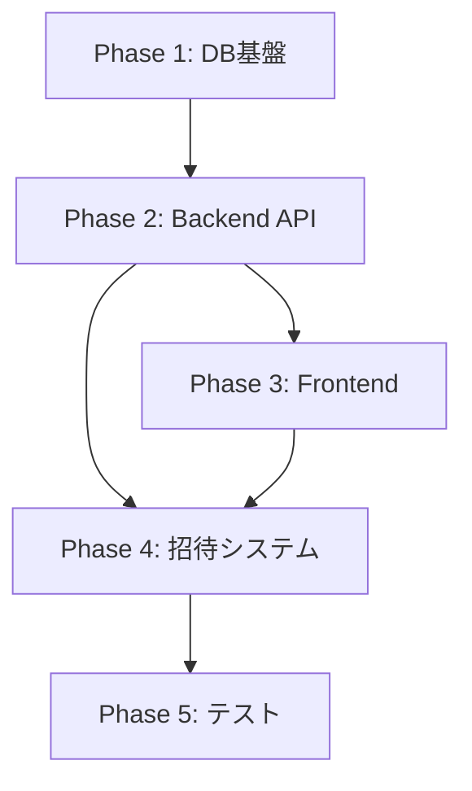

# Task Master 認証・組織管理システム実装タスク（AI向け）

## 概要
このドキュメントは、AIが認証・組織管理システムを実装する際の詳細なタスク分解とプロンプトを含みます。
総工数: 17.5人日（5フェーズ）

## Phase 1: データベース基盤の構築（3日）

### Task 1.1: Supabaseマイグレーションファイルの作成（0.5日）

**プロンプト**:
```
Task Master プロジェクトのSupabaseデータベースに認証・組織管理用のマイグレーションファイルを作成してください。

以下のテーブルを作成するSQLを含めてください：
1. organizations (id, name, created_at, updated_at)
2. profiles (id, full_name, avatar_url, created_at, updated_at)
3. organization_members (organization_id, profile_id, role, joined_at)

また、以下の変更も含めてください：
- projectsテーブルにorganization_id列を追加
- tasksテーブルのassignee_id外部キーをprofiles(id)に変更

ファイルパス: supabase/migrations/[timestamp]_add_authentication.sql
```

### Task 1.2: トリガーとファンクションの実装（0.5日）

**プロンプト**:
```
Supabaseで新規ユーザー登録時に自動的にprofileレコードを作成するトリガーを実装してください。

要件：
1. auth.usersテーブルへのINSERT時にトリガー
2. raw_user_meta_dataからfull_nameを取得
3. profilesテーブルに自動挿入
4. updated_atを自動更新するトリガーも作成

ファイルパス: supabase/migrations/[timestamp]_add_auth_triggers.sql
```

### Task 1.3: RLSポリシーの実装（1日）

**プロンプト**:
```
全テーブルにRow Level Security (RLS)ポリシーを実装してください。

ポリシー要件：
1. organizations: 所属メンバーのみ閲覧可能、管理者のみ更新・削除可能
2. profiles: 同じ組織のメンバーのみ閲覧可能、本人のみ更新可能
3. organization_members: 同じ組織のメンバーが閲覧可能、管理者のみ追加・更新・削除可能
4. projects: 所属組織のプロジェクトのみアクセス可能
5. tasks: 所属組織のタスクのみアクセス可能

既存の"Enable all operations for all users"ポリシーは削除してください。

ファイルパス: supabase/migrations/[timestamp]_add_rls_policies.sql
```

### Task 1.4: 既存データの移行スクリプト（0.5日）

**プロンプト**:
```
既存のmembersテーブルのデータを新しい認証システムに移行するスクリプトを作成してください。

移行内容：
1. デフォルト組織"Default Organization"を作成
2. membersテーブルの各レコードをprofilesテーブルに移行
3. 全メンバーをデフォルト組織の管理者として追加
4. 全プロジェクトにorganization_idを設定

安全性のため、トランザクション内で実行し、ロールバック可能にしてください。

ファイルパス: supabase/migrations/[timestamp]_migrate_existing_data.sql
```

### Task 1.5: インデックスの最適化（0.5日）

**プロンプト**:
```
認証・組織管理システムのパフォーマンスを最適化するためのインデックスを追加してください。

必要なインデックス：
1. organizations(name) - 組織名検索用
2. organization_members(profile_id) - ユーザーの組織一覧取得用
3. projects(organization_id) - 組織のプロジェクト一覧取得用
4. 複合インデックス: organization_members(profile_id, role)

ファイルパス: supabase/migrations/[timestamp]_add_auth_indexes.sql
```

## Phase 2: バックエンドAPI実装（5日）

### Task 2.1: 認証ミドルウェアの実装（0.5日）

**プロンプト**:
```
Express.js用の認証ミドルウェアを実装してください。

要件：
1. Bearerトークンの検証
2. Supabase auth.getUser()を使用したトークン検証
3. req.userにユーザー情報を格納
4. エラーハンドリング（401レスポンス）

ファイルパス: api/middleware/auth.js

既存のコードスタイルに合わせ、logger.jsを使用してログを出力してください。
```

### Task 2.2: RBACミドルウェアの実装（0.5日）

**プロンプト**:
```
ロールベースアクセス制御（RBAC）ミドルウェアを実装してください。

要件：
1. organization_idをパスパラメータから取得
2. ユーザーの組織内ロールを確認
3. 必要な権限がない場合は403エラー
4. req.organization_memberにロール情報を格納

使用例: rbacMiddleware('admin') で管理者のみアクセス可能

ファイルパス: api/middleware/rbac.js
```

### Task 2.3: Auth APIエンドポイントの実装（1.5日）

**プロンプト**:
```
認証関連のAPIエンドポイントを実装してください。

実装するエンドポイント：
1. POST /api/v1/auth/signup - ユーザー登録
2. POST /api/v1/auth/login - ログイン
3. POST /api/v1/auth/logout - ログアウト
4. POST /api/v1/auth/refresh - トークンリフレッシュ
5. DELETE /api/v1/auth/user - アカウント削除

要件：
- 入力検証（メール形式、パスワード強度）
- 適切なエラーレスポンス
- Supabase Authの使用
- 既存のlogger.jsを使用

ファイルパス: api/routes/auth.js
```

### Task 2.4: Organizations APIエンドポイントの実装（1日）

**プロンプト**:
```
組織管理のAPIエンドポイントを実装してください。

実装するエンドポイント：
1. POST /api/v1/organizations - 組織作成
2. GET /api/v1/organizations - 組織一覧取得
3. GET /api/v1/organizations/:orgId - 組織詳細取得
4. PUT /api/v1/organizations/:orgId - 組織情報更新

要件：
- 認証ミドルウェアの使用
- 組織作成時は作成者を管理者として追加
- ページネーション対応（一覧取得）
- 適切なエラーハンドリング

ファイルパス: api/routes/organizations.js
```

### Task 2.5: メンバー管理APIの実装（1日）

**プロンプト**:
```
組織のメンバー管理APIを実装してください。

実装するエンドポイント：
1. POST /api/v1/organizations/:orgId/invites - ユーザー招待
2. GET /api/v1/organizations/:orgId/members - メンバー一覧
3. PUT /api/v1/organizations/:orgId/members/:profileId - ロール更新
4. DELETE /api/v1/organizations/:orgId/members/:profileId - メンバー削除

要件：
- RBACミドルウェアで管理者権限を確認
- 既存ユーザーの場合は即座に追加
- 最後の管理者は削除不可
- Supabase Admin APIの使用

organizationsルートに統合してください。
```

### Task 2.6: 既存APIの認証統合（0.5日）

**プロンプト**:
```
既存のAPI（projects, tasks, dependencies等）に認証を統合してください。

実装内容：
1. 全ルートに認証ミドルウェアを適用
2. organization_idでのフィルタリング追加
3. エラーレスポンスの統一
4. server.jsまたはserver-db.jsでミドルウェアを登録

影響を受けるファイル：
- api/server.js または api/server-db.js
- api/routes/projects.js または api/routes/projects-db.js
- api/routes/tasks.js または api/routes/tasks-db.js

既存の機能を壊さないよう注意してください。
```

## Phase 3: フロントエンド実装（4日）

### Task 3.1: 認証コンテキストの実装（0.5日）

**プロンプト**:
```
Next.js/React用の認証コンテキストを実装してください。

要件：
1. AuthContextとuseAuthフックの作成
2. ログイン、サインアップ、ログアウト機能
3. トークン管理（CookieまたはlocalStorage）
4. 自動トークンリフレッシュ
5. 初回ロード時の認証状態確認

ファイルパス: 
- frontend/task-master-ui/contexts/AuthContext.tsx
- frontend/task-master-ui/hooks/useAuth.ts

TypeScriptで実装し、既存のコードスタイルに合わせてください。
```

### Task 3.2: 認証UIコンポーネントの作成（1日）

**プロンプト**:
```
認証関連のUIコンポーネントを作成してください。

作成するコンポーネント：
1. LoginForm - ログインフォーム
2. SignupForm - サインアップフォーム（パスワード確認付き）
3. ProtectedRoute - 認証が必要なルートのラッパー

要件：
- react-hook-formとzodでバリデーション
- 既存のUIコンポーネント（Input, Button等）を使用
- エラー表示とローディング状態
- レスポンシブデザイン

ファイルパス: frontend/task-master-ui/components/auth/
```

### Task 3.3: 認証ページの実装（0.5日）

**プロンプト**:
```
認証関連のページを実装してください。

作成するページ：
1. /login - ログインページ
2. /signup - サインアップページ
3. /auth/verify-email - メール確認待機ページ

要件：
- 認証済みユーザーは/dashboardへリダイレクト
- 適切なメタタグとタイトル
- モバイル対応

ファイルパス: frontend/task-master-ui/app/(auth)/
```

### Task 3.4: 組織管理UIの実装（1日）

**プロンプト**:
```
組織管理のUIコンポーネントとページを実装してください。

作成するコンポーネント：
1. CreateOrganizationForm - 組織作成フォーム
2. OrganizationSelector - ヘッダーの組織選択ドロップダウン
3. OrganizationContext - 現在の組織を管理

作成するページ：
1. /setup-organization - 初回ログイン時の組織作成
2. /settings/organization - 組織設定ページ

ファイルパス: 
- frontend/task-master-ui/components/organization/
- frontend/task-master-ui/app/setup-organization/
```

### Task 3.5: APIクライアントの更新（0.5日）

**プロンプト**:
```
既存のAPIクライアント（lib/api.ts）を認証対応に更新してください。

実装内容：
1. Axiosインターセプターでトークン自動付与
2. 401エラー時の自動トークンリフレッシュ
3. リフレッシュ失敗時のログイン画面へのリダイレクト
4. 新しい認証エンドポイントの追加

既存のAPI呼び出しが動作し続けるよう後方互換性を保ってください。
```

### Task 3.6: 既存ページの認証対応（0.5日）

**プロンプト**:
```
既存のページとコンポーネントを認証対応にしてください。

実装内容：
1. app/(authenticated)/layoutで認証チェック
2. ProjectListで組織によるフィルタリング
3. ヘッダーにユーザー情報とログアウトボタン追加
4. 組織選択ドロップダウンの統合

影響を受けるファイル：
- frontend/task-master-ui/app/layout.tsx
- frontend/task-master-ui/components/dashboard/ProjectList.tsx
```

## Phase 4: 招待システムとメンバー管理（3日）

### Task 4.1: 招待メール送信機能（1日）

**プロンプト**:
```
メール招待機能を実装してください。

実装内容：
1. Supabaseのメールテンプレート設定
2. 招待リンクの生成とトラッキング
3. 未登録ユーザーの招待フロー
4. 招待受諾後の自動組織追加

バックエンド：
- api/services/invitation-service.js

フロントエンド：
- 招待受諾ページ（/invite/[token]）
```

### Task 4.2: メンバー管理UIの実装（1日）

**プロンプト**:
```
組織のメンバー管理画面を実装してください。

実装内容：
1. メンバー一覧テーブル（DataTable使用）
2. メンバー招待モーダル
3. ロール変更機能
4. メンバー削除確認ダイアログ

要件：
- 管理者のみアクセス可能
- リアルタイム更新（React Query）
- 検索とフィルタリング機能

ファイルパス: frontend/task-master-ui/app/settings/members/
```

### Task 4.3: 通知システムの基盤（0.5日）

**プロンプト**:
```
招待通知用の基本的な通知システムを実装してください。

実装内容：
1. 通知テーブルの追加（notifications）
2. 通知作成のヘルパー関数
3. フロントエンドの通知表示（トースト）

今後の拡張を考慮した設計にしてください。

ファイルパス：
- supabase/migrations/[timestamp]_add_notifications.sql
- api/services/notification-service.js
```

### Task 4.4: 組織切り替え機能（0.5日）

**プロンプト**:
```
複数組織に所属するユーザーの組織切り替え機能を実装してください。

実装内容：
1. 現在の組織をlocalStorageに保存
2. 組織切り替え時のデータリフレッシュ
3. デフォルト組織の選択ロジック
4. URLベースの組織スコープ（オプション）

影響範囲：
- OrganizationContext
- すべてのAPI呼び出し
```

## Phase 5: テストとドキュメント（2.5日）

### Task 5.1: 統合テストの実装（1日）

**プロンプト**:
```
認証・組織管理システムの統合テストを実装してください。

テスト内容：
1. 認証フロー（サインアップ → ログイン → 組織作成）
2. RLSポリシーの動作確認
3. APIエンドポイントの権限チェック
4. エラーケースのテスト

使用ツール：
- Jest
- Supertest
- Supabaseテスト環境

ファイルパス: tests/integration/auth/
```

### Task 5.2: E2Eテストの実装（0.5日）

**プロンプト**:
```
主要な認証フローのE2Eテストを実装してください。

テストシナリオ：
1. 新規ユーザーの完全なオンボーディング
2. 組織へのメンバー招待と受諾
3. 権限に基づくアクセス制御

使用ツール：
- Playwright
- テスト用のメール確認モック

ファイルパス: tests/e2e/auth-flow.spec.ts
```

### Task 5.3: APIドキュメントの更新（0.5日）

**プロンプト**:
```
認証関連APIのドキュメントを更新してください。

更新内容：
1. 新しいエンドポイントの追加
2. 認証ヘッダーの説明
3. エラーレスポンスの一覧
4. 使用例とcURLコマンド

ファイルパス: api-test-results/COMPLETE_API_REFERENCE.md

既存のフォーマットに合わせてください。
```

### Task 5.4: 環境設定ドキュメント（0.5日）

**プロンプト**:
```
認証システムの環境設定ガイドを作成してください。

内容：
1. 必要な環境変数の一覧
2. Supabaseプロジェクトの設定手順
3. メール設定（SMTP）
4. 本番環境のセキュリティ設定

ファイルパス: 
- .env.example の更新
- docs/authentication-setup.md
```

## 実装順序と依存関係



## 重要な注意事項

1. **既存機能の保護**: 既存のプロジェクト・タスク管理機能を壊さないよう注意
2. **段階的移行**: 一度にすべてを変更せず、段階的に移行
3. **テスト駆動**: 各機能の実装前にテストを書く
4. **セキュリティ優先**: すべての実装でセキュリティを最優先に考慮
5. **ドキュメント**: 実装と同時にドキュメントを更新

## 各フェーズの完了条件

### Phase 1完了条件
- [ ] すべてのマイグレーションが正常に実行される
- [ ] RLSポリシーが正しく機能する
- [ ] 既存データが正しく移行される

### Phase 2完了条件
- [ ] すべてのAPIエンドポイントが動作する
- [ ] 認証なしでのアクセスが拒否される
- [ ] 既存APIが認証付きで動作する

### Phase 3完了条件
- [ ] ユーザーがサインアップ/ログインできる
- [ ] 組織の作成と選択ができる
- [ ] 既存機能が認証付きで動作する

### Phase 4完了条件
- [ ] メンバーの招待と管理ができる
- [ ] 複数組織の切り替えができる
- [ ] 権限に基づくアクセス制御が機能する

### Phase 5完了条件
- [ ] すべてのテストが合格する
- [ ] ドキュメントが最新である
- [ ] 本番環境へのデプロイ準備が完了する